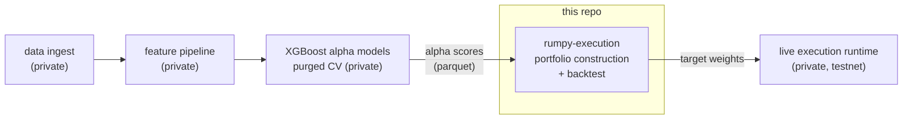
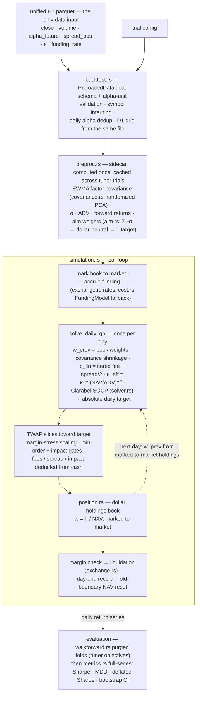

# rumpy-execution

Cost-aware portfolio optimizer and backtester for crypto long/short execution, in Rust. A Clarabel SOCP with transaction costs *inside* the objective — fees, spread, square-root market impact as a power cone — plus a holdings-based simulation engine, purged walk-forward evaluation, and a battery of probes that independently verify the solver's optimality certificate rather than trusting it.

## Where this fits

This is one crate extracted from **rumpy**, a private ~134k-LOC Rust research monorepo (23 crates) covering the full pipeline: exchange data ingest → feature building → XGBoost alpha models with purged CV → **execution (this repo)** → evaluation. The execution layer is the piece that's publishable: its inputs are generic per-asset alpha scores, its cost methodology is published literature, and it has zero dependencies on the rest of the workspace. Signal generation, features, and trained models stay private — that's the point.



## What it does

The backtest consumes **one input file** — a unified H1 parquet carrying `close · volume · alpha_future · spread_bps · κ · funding_rate` per (timestamp, symbol) — plus a trial config. Alpha arrives already blended and scored by the private upstream; this crate's job starts at portfolio construction. The strategic loop is **daily**; hourly bars exist as TWAP fill slices.

1. **Load & precompute** (`backtest.rs`, `preproc.rs`) — validate the parquet (alpha-unit metadata mismatch is a hard failure), intern symbols, dedupe alpha to daily rows, extract the D1 grid *from the same file*. A preproc sidecar then computes — once, cached across tuner trials — the EWMA factor covariance (randomized PCA, O(N²k) per refit), realized vol, ADV, forward returns, and the aim portfolio: w_aim = Σ⁻¹α, projected dollar-neutral, gross rescaled to the leverage target (`covariance.rs`, `aim.rs`).
2. **Solve — once per day** (`simulation.rs::solve_daily_qp` → `solver.rs`) — the engine hands the solver the *book's* marked-to-market weights as w_prev, applies covariance shrinkage, computes the linear cost c_lin = tiered fee + spread/2 and the impact coefficient κ_eff = κ·σ·(NAV/ADV)^δ per asset, and runs a single Clarabel SOCP solve producing absolute daily target weights.
3. **Fill** (`simulation.rs`) — per bar, the engine trades a TWAP fraction toward the target (or one daily fill in market mode), scaled down under margin stress, with min-order-size and impact gates deferring trades; tiered fees and realized spread/impact costs are deducted from cash.
4. **Account** (`position.rs`, `exchange.rs`) — the dollar-denominated book marks to market, accrues hourly funding (actual rates, EWMA model fallback), force-closes stuck positions, and runs the margin check with full liquidation on breach. At each day's last bar it emits the daily record.
5. **Evaluate** (`walkforward.rs`, `metrics.rs`) — the daily return series is sliced into purged walk-forward folds (per-fold metrics feed tuner objectives), then scored full-series: Sharpe, max drawdown, deflated Sharpe, block-bootstrap CIs.

Several modules ship as **exported library surface with no in-crate caller** — they're wired by the private orchestration around this engine: `gates.rs` (pre-trade hard checks), `universe.rs` (tradable-universe hysteresis), `ml_cost.rs` (cost-input resolution), `alpha.rs`'s z-score/blend implementations (the blend runs upstream; the backtest consumes its output), `io.rs`'s weight writers, `diagnostics.rs`'s per-stage snapshot machinery, and the PyO3 bindings (`python.rs`, feature-gated).

The crate is also the **inner loop of a hyperparameter search**: the private Python side runs Optuna over execution parameters, calling this engine (natively or via the PyO3 bindings) as the objective function. That pressure shaped the design — the preproc sidecar exists so derived lookups are computed once and cached across trials rather than rebuilt per trial, and `walkforward.rs` aggregates purged per-fold metrics directly into tuner objectives. It's why this layer is in Rust in the first place: the backtest has to be cheap enough to run thousands of times.

## The optimization problem

The QP's base layout is 6n variables — `x = [w, u, t, t_imp, y, s]`: weights, turnover auxiliaries `u ≥ |Δw|`, gross-exposure auxiliaries `t ≥ |w|`, impact-cone slacks `t_imp ≥ u^1.5` encoded as PowerCone(2/3), the cone's unit third coordinates `y`, and ReLU residuals `s` — plus optional blocks when the SOC vol-target or top-k features are enabled. The objective is

```
min  −α′w + γ·w′Σw + λ_aim·‖w − w_aim‖² + c_lin′u + Σ s
     s.t.  Σw = 0 (dollar-neutral) · Σt ≤ L_max (gross cap) · per-name caps
           s_i ≥ κ_eff·t_imp,i − r_i·u_i  (impact above the free allowance r)
```

so the solver prices the **realized** impact-cost curve rather than a linearization of it (with `r = 0` this reduces to a pure κ·t_imp cone objective — the two formulations are compared quantitatively by `probe_qref`). Turnover is priced through `c_lin′u`, not capped. There is no fallback solver: a failed solve carries the previous target forward.

## Inside the crate

How a backtest actually moves through the modules — solid arrows are the data path, the dashed arrow is the feedback loop that makes the simulation holdings-based rather than open-loop:



The dashed `w_prev` edge is the crate's core design commitment: the optimizer's next input comes from the *book* — real dollar holdings marked to market — never from its own previous output.

## Numerical-correctness probes

The part of this repo I'd defend hardest. Solvers converge to tolerances against whatever problem you actually encoded — which is not always the problem you meant. Each probe in `examples/` independently verifies a load-bearing numerical claim against a closed-form reference or an external invariant:

| Probe | Verifies |
|---|---|
| `socp_probe` | PowerCone(2/3) genuinely encodes t ≥ u^1.5 — solution matches a 1-D problem with closed-form KKT conditions; also determinism and speed vs the plain QP |
| `probe_kkt` | The cone term makes the optimizer minimize the *realized* cost: cone objective equals realized cost at the solution, the numerical marginal cost matches the analytic gradient 1.5κ√u, and — the counterfactual — deliberately using the wrong coefficient (1.5κ, a leftover from an earlier SLP linearization) produces a materially different solution, proving the distinction matters |
| `probe_units` | Dimensional analysis: the κ_eff = κ·σ·(NAV/ADV)^δ plumbed into the cone charges the same *dollars* as the PnL accounting — catches off-by-NAV scaling bugs that compile fine and silently mis-charge by orders of magnitude |
| `probe_qref` | Quantifies the solution difference between two impact-cone formulations (full-cost vs residual-above-reference) before choosing one |
| `probe_perf` | Production-scale n=200 solve times; tests the warm-start expectation (nonsymmetric-cone warm starts give little speedup — consistent with MOSEK's documentation) rather than assuming it |
| `cross_platform_check` | Byte-level float determinism across machines — prints bit patterns, not formatted values, so a diff catches sub-ULP divergence that printf would hide |

```bash
cargo run --release --example probe_kkt
cargo run --release --example cross_platform_check   # run on two machines, diff stdout
```

## Component map

| Path | Responsibility | Tests |
|---|---|---|
| `src/solver.rs` | Clarabel SOCP formulation — 6n base variables, power-cone impact, optional vol-target/top-k blocks | 9 |
| `src/simulation.rs` | The engine: bar loop, daily QP solve (cost coefficients computed here), TWAP fills, margin stress — the reference execution loop | 44 |
| `src/position.rs` | Dollar-denominated position book; weights derived from marked-to-market NAV | 13 |
| `src/exchange.rs` | Fee tiers (14-day trailing volume), hourly funding, cross-margin mechanics, liquidation | 38 |
| `src/cost.rs` | `FundingModel` — AR(1) closed-form expected funding (Koijen et al. 2018 carry framework) — plus cost-primitive reference implementations (exported) | 12 |
| `src/ml_cost.rs` | Cost-input resolution: L2 book-walk data → ML-predicted spread/κ from parquet → hard error, never a silent fallback (exported surface) | 7 |
| `src/covariance.rs` | EWMA factor covariance with randomized PCA; factor-form storage, on-demand submatrix reconstruction | 3 |
| `src/aim.rs` | Aim portfolio Σ⁻¹α (ridge-regularized Cholesky), dollar-neutral projection, gross rescale to leverage target | 2 |
| `src/backtest.rs` | Backtest entry point over the unified H1 parquet; preload/rebuild provenance; dhat heap profiling behind a feature flag | 7 |
| `src/walkforward.rs` | Purged walk-forward CV — excluded return-windows between folds guard the persistent w_prev chain; aggregates fold metrics into Optuna objectives | 3 |
| `src/metrics.rs` | Pure-math return-series metrics incl. deflated Sharpe and block-bootstrap CIs | 17 |
| `src/gates.rs` | Pre-trade hard checks (defer, don't reject) — exported surface | 9 |
| `src/universe.rs` | Tradable-universe hysteresis state machine (Excluded → Active → ExitOnly) — exported surface | 9 |
| `src/alpha.rs`, `src/io.rs`, `src/diagnostics.rs` | Upstream z-score/blend reference, parquet weight I/O, per-stage snapshot machinery — exported surface; the in-crate path uses only fragments (e.g. date helpers) | 5 |
| `src/python.rs` | Optional PyO3 bindings (`--features python`) for the Python research side | — |

## Key design decisions

1. **Verify the solver's certificate; don't trust convergence.** A returned "optimal" is a claim. The KKT probes recompute optimality conditions against closed-form references — and the counterfactual sub-test exists because an earlier Python implementation carried a 1.5κ gradient coefficient from SLP linearization into a context where the raw κ was correct. The probe proves the two produce materially different portfolios. *Rejected: assuming a solved status means the intended problem was solved.*

2. **Holdings in dollars, weights derived.** The simulation tracks actual dollar positions and marks to market; the optimizer receives weights derived from real NAV, not its own previous output (Boyd et al. 2017, cvxportfolio). A weight-only chain compounds drift between what the optimizer believes and what the book holds. *Rejected: the weight-only pipeline this engine replaced.*

3. **Costs inside the objective, not applied after.** Linear costs price turnover directly (c_lin′u) and impact enters through the power cone — with a ReLU residual formulation that charges impact only above a free allowance, chosen after `probe_qref` quantified the difference. Optimizing cost-blind and deducting afterwards systematically overtrades. Funding is always *accrued* in the PnL; feeding the AR(1) expected-funding model into alpha pre-optimization exists as an opt-in config flag, off by default. *Rejected: optimize-then-deduct.*

4. **Hard errors over silent fallbacks in the cost chain.** In the strict production mode, a missing ML cost prediction is a data-pipeline failure and raises; it does not fall back to a tier average that would silently mis-price a fill. The same posture at load time: an alpha-unit metadata mismatch refuses to run. *Rejected: permissive defaults.*

5. **Evaluation that resists self-deception.** Walk-forward folds exclude return-windows between evaluation windows so the persistent w_prev state chain can't leak across fold boundaries; headline numbers ship with deflated Sharpe (multiple-testing-aware) and block-bootstrap confidence intervals rather than a naive point Sharpe. *Rejected: overlapping-window Sharpe as the objective.*

## Testing

177 unit tests, heaviest where the money moves: simulation (44), exchange mechanics (38), metrics (17), position book (13), cost model (12). The probes above are the second layer — executable verification of the numerical claims unit tests can't reach. All tests run in under a second:

```bash
cargo test
cargo build --release --examples
```

## Status — honest scope

- This is the research/backtest execution layer of a private system. **It does not trade live** — the live runtime is a separate private service, and it runs testnet.
- Inputs (alpha scores, prices, spreads, impact coefficients, funding) arrive in a single parquet with a documented schema (`backtest.rs`); no data or trained models are included.
- The exchange model defaults to Hyperliquid perpetual mechanics (public fee/margin parameters); it's a config struct, deliberately not yet a trait — one exchange doesn't justify the abstraction.
- Extracted from the parent monorepo 2026-08; fresh history from that point.

## License

MIT
