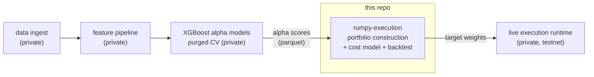
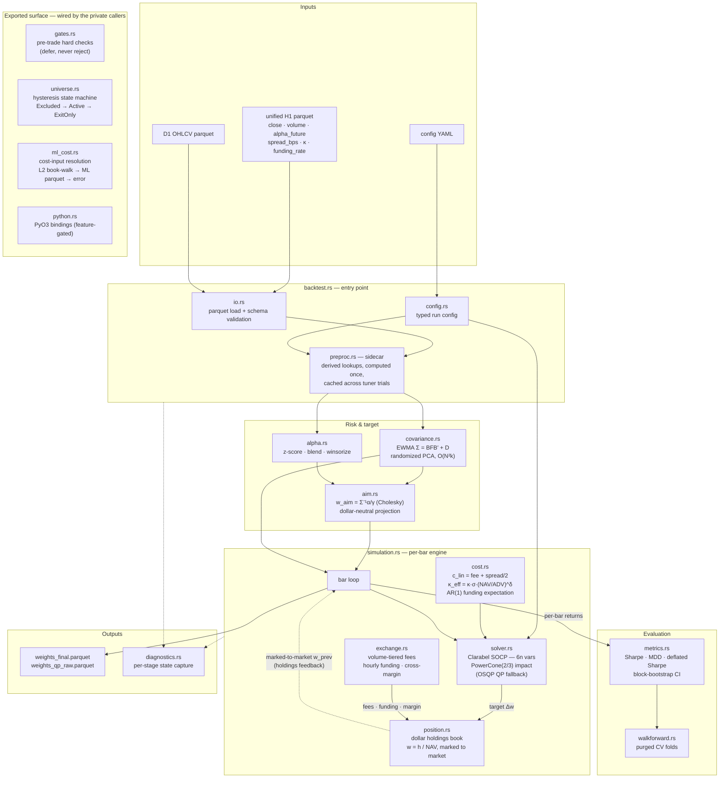

# rumpy-execution

Cost-aware portfolio optimizer and backtester for crypto long/short execution, in Rust. A Clarabel SOCP with transaction costs *inside* the objective — fees, spread, square-root market impact as a power cone, and funding — plus a holdings-based simulation engine, purged walk-forward evaluation, and a battery of probes that independently verify the solver's optimality certificate rather than trusting it.

## Where this fits

This is one crate extracted from **rumpy**, a private ~134k-LOC Rust research monorepo (23 crates) covering the full pipeline: exchange data ingest → feature building → XGBoost alpha models with purged CV → **execution (this repo)** → evaluation. The execution layer is the piece that's publishable: its inputs are generic per-asset alpha scores, its cost methodology is published literature, and it has zero dependencies on the rest of the workspace. Signal generation, features, and trained models stay private — that's the point.



## What it does

Per hourly bar, for an n-asset dollar-neutral book:

1. **Preprocess** alpha scores — z-score, multi-horizon persistence blend, winsorize (`preproc.rs`)
2. **Estimate risk** — EWMA factor covariance Σ = BFB′ + D via randomized PCA: O(N²k) instead of O(N³) per refit (`covariance.rs`)
3. **Aim portfolio** — the cost-free Markowitz target w_aim = Σ⁻¹α/γ, projected dollar-neutral (`aim.rs`)
4. **Solve the SOCP** — minimize distance-to-aim plus *realized* trading costs, subject to dollar neutrality, gross-exposure and turnover caps (`solver.rs`)
5. **Simulate** — bar-by-bar holdings-based engine: dollar positions, cost deduction from cash, weights derived from marked-to-market NAV, exchange fee tiers / hourly funding / margin mechanics (`simulation.rs`, `position.rs`, `exchange.rs`)
6. **Evaluate** — Sharpe, max drawdown, hit rate, turnover, block-bootstrap CIs, deflated Sharpe; purged walk-forward CV for tuning (`metrics.rs`, `walkforward.rs`)

Three further modules — `gates.rs` (pre-trade hard checks), `universe.rs` (tradable-universe hysteresis), and `ml_cost.rs` (cost-input resolution) — are exported library surface: the private orchestration around this engine wires them in, so they ship here with their tests but have no in-crate caller.

The QP has 6n variables — weights plus auxiliaries for turnover `|Δw|`, gross exposure `|w|`, and the impact cone `t ≥ |Δw|^1.5` encoded as a PowerCone(2/3). Market impact enters the objective as κ·t, so the optimizer minimizes the **realized** cost function itself, not a linearization of it.

## Inside the crate

How a backtest actually moves through the modules — solid arrows are the data path, the dashed arrow is the feedback loop that makes the simulation holdings-based rather than open-loop:



The dashed `w_prev` edge is the crate's core design commitment: the optimizer's next input comes from the *book* — real dollar holdings marked to market — never from its own previous output.

## Numerical-correctness probes

The part of this repo I'd defend hardest. Solvers converge to tolerances against whatever problem you actually encoded — which is not always the problem you meant. Each probe in `examples/` independently verifies a load-bearing numerical claim against a closed-form reference or an external invariant:

| Probe | Verifies |
|---|---|
| `socp_probe` | PowerCone(2/3) genuinely encodes t ≥ u^1.5 — solution matches a 1-D problem with closed-form KKT conditions; also determinism and speed vs the plain QP |
| `probe_kkt` | The cone term makes the optimizer minimize the *realized* cost: cone objective equals realized cost at the solution, the numerical marginal cost matches the analytic gradient 1.5κ√u, and — the counterfactual — deliberately using the wrong coefficient (1.5κ, a leftover from an earlier SLP linearization) produces a materially different solution, proving the distinction matters |
| `probe_units` | Dimensional analysis: the κ_eff = κ·σ·(NAV/ADV)^δ plumbed into the cone charges the same *dollars* as the PnL accounting — catches off-by-NAV scaling bugs that compile fine and silently mis-charge by orders of magnitude |
| `probe_qref` | Quantifies the solution difference between two impact-cone formulations (full-cost vs residual-above-reference) before choosing one |
| `probe_perf` | Production-scale n=200 solve times; tests the warm-start expectation (nonsymmetric-cone warm starts give little speedup — consistent with MOSEK's documentation) rather than assuming it |
| `cross_platform_check` | Byte-level float determinism across machines — prints bit patterns, not formatted values, so a diff catches sub-ULP divergence that printf would hide |

```bash
cargo run --release --example probe_kkt
cargo run --release --example cross_platform_check   # run on two machines, diff stdout
```

## Component map

| Path | Responsibility | Tests |
|---|---|---|
| `src/solver.rs` | Clarabel SOCP formulation (6n vars, power-cone impact); OSQP QP fallback | 9 |
| `src/simulation.rs` | Holdings-based bar-by-bar engine — the reference execution loop | 44 |
| `src/position.rs` | Dollar-denominated position book; weights derived from marked-to-market NAV | 13 |
| `src/exchange.rs` | Fee tiers (14-day trailing volume), hourly funding, cross-margin mechanics | 38 |
| `src/cost.rs` | Cost primitives: EWMA ADV, realized vol, linear + sqrt-impact coefficients, AR(1) closed-form expected funding (Koijen et al. 2018 carry framework) | 12 |
| `src/ml_cost.rs` | Cost-input resolution: L2 book-walk data when available → ML-predicted spread/κ from parquet → hard error (never a silent fallback) | 7 |
| `src/covariance.rs` | EWMA factor covariance with randomized PCA; factor-form storage, on-demand submatrix reconstruction | 3 |
| `src/aim.rs` | Cost-free Markowitz aim portfolio (Cholesky), dollar-neutral projection | 2 |
| `src/backtest.rs` | Backtest entry point over a unified H1 parquet; dhat heap profiling behind a feature flag | 7 |
| `src/walkforward.rs` | Purged walk-forward CV — purging guards the w_prev state chain across fold boundaries | 3 |
| `src/metrics.rs` | Pure-math return-series metrics incl. deflated Sharpe and block-bootstrap CIs | 17 |
| `src/gates.rs` | Pre-trade hard checks (defer, don't reject) | 9 |
| `src/universe.rs` | Tradable-universe hysteresis state machine (Excluded → Active → ExitOnly) | 9 |
| `src/diagnostics.rs` | Per-stage state capture so a wrong number is traceable to the exact stage that produced it | — |
| `src/python.rs` | Optional PyO3 bindings (`--features python`) for the Python research side | — |

## Key design decisions

1. **Verify the solver's certificate; don't trust convergence.** A returned "optimal" is a claim. The KKT probes recompute optimality conditions against closed-form references — and the counterfactual sub-test exists because an earlier Python implementation carried a 1.5κ gradient coefficient from SLP linearization into a context where the raw κ was correct. The probe proves the two produce materially different portfolios. *Rejected: assuming a solved status means the intended problem was solved.*

2. **Holdings in dollars, weights derived.** The simulation tracks actual dollar positions and marks to market; the optimizer receives weights derived from real NAV, not its own previous output (Boyd et al. 2017, cvxportfolio). A weight-only chain compounds drift between what the optimizer believes and what the book holds. *Rejected: the weight-only pipeline this engine replaced.*

3. **Costs inside the objective, not applied after.** Impact enters as a power cone so the solver trades expected alpha against the true cost curve; funding is subtracted from alpha pre-optimization as an AR(1) closed-form expectation. Optimizing cost-blind and deducting afterwards systematically overtrades. *Rejected: optimize-then-deduct.*

4. **Hard errors over silent fallbacks in the cost chain.** A missing ML cost prediction is a data-pipeline failure and raises; it does not fall back to a tier average that would silently mis-price a fill. *Rejected: permissive defaults.*

5. **Evaluation that resists self-deception.** Walk-forward folds are purged so the w_prev state chain can't leak across boundaries; headline numbers ship with deflated Sharpe (multiple-testing-aware) and block-bootstrap confidence intervals rather than a naive point Sharpe. *Rejected: overlapping-window Sharpe as the objective.*

## Testing

177 unit tests, heaviest where the money moves: simulation (44), exchange mechanics (38), metrics (17), position book (13), cost model (12). The probes above are the second layer — executable verification of the numerical claims unit tests can't reach. All tests run in under a second:

```bash
cargo test
cargo build --release --examples
```

## Status — honest scope

- This is the research/backtest execution layer of a private system. **It does not trade live** — the live runtime is a separate private service, and it runs testnet.
- Inputs (alpha scores, OHLCV, funding, cost predictions) arrive as parquet with a documented schema (`io.rs`, `backtest.rs`); no data or trained models are included.
- The exchange model defaults to Hyperliquid perpetual mechanics (public fee/margin parameters); it's a config struct, deliberately not yet a trait — one exchange doesn't justify the abstraction.
- Extracted from the parent monorepo 2026-08; fresh history from that point.

## License

MIT
